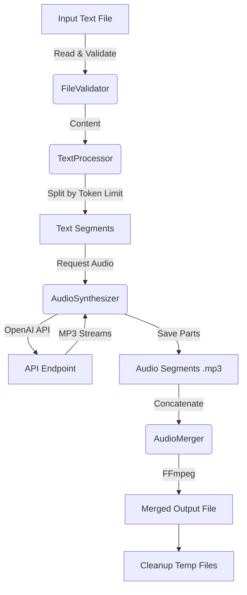

# Architecture Overview

This document describes the high-level architecture and design of the `tts-js` tool.

## System Overview

`tts-js` is a CLI tool designed to convert large text files into high-quality audio using OpenAI's Text-to-Speech API. It handles token limits by intelligently splitting text, synthesizing audio segments in parallel (with rate limiting), and merging them into a single MP3 file.

## Data Flow Diagram



## Key Components

### 1. `TTSConfig`
- **Responsibility**: Manages application configuration.
- **Details**: Loads environment variables (`OPENAI_API_KEY`), sets defaults for model (`gpt-4o-mini-tts`), voice, and token limits.

### 2. `FileValidator`
- **Responsibility**: Ensures input file safety and validity.
- **Checks**:
    - Path traversal prevention.
    - File existence and read permissions.
    - File size limits (default 100MB).

### 3. `TextProcessor`
- **Responsibility**: Prepares text for API consumption.
- **Logic**:
    - Uses `js-tiktoken` (`cl100k_base`) to count tokens.
    - Splits text at sentence boundaries (`/[:.?]/` etc.) to ensure chunks stay within the token limit (default 1600 tokens) without cutting mid-sentence.

### 4. `AudioSynthesizer`
- **Responsibility**: Interfaces with OpenAI API.
- **Features**:
    - Handles API network requests.
    - Implements retry logic with exponential backoff for resilience.
    - Saves individual audio parts to disk.

### 5. `AudioMerger`
- **Responsibility**: Combines audio parts.
- **Implementation**: Uses `ffmpeg` (via `child_process.spawn`) to concatenate MP3 files losslessly (`-c copy`).

### 6. `TTSProcessor` (Main)
- **Responsibility**: Orchestrates the entire workflow.
- **Flow**: Validation -> Splitting -> Synthesis -> Merging -> Cleanup.

## Directory Structure

```
ttsjs/
├── data/               # Example data input/output
├── docs/               # Documentation
│   ├── ARCHITECTURE.md # System design (This file)
│   ├── CHANGELOG.md    # Version history
│   ├── DECISIONS.md    # Architectural Decision Records (ADRs)
│   └── LESSONS.md      # Learnings and dev heuristics
├── .agent/             # Agent configuration and workflows
├── node_modules/       # Dependencies
├── tts.js              # Main application entry point
├── package.json        # Project config and dependencies
└── README.md           # User guide
```

## Technical Stack

- **Runtime**: Node.js (v18+)
- **Language**: JavaScript (ESM)
- **External Tools**: `ffmpeg`
- **Key Libraries**: `openai`, `js-tiktoken`, `dotenv`